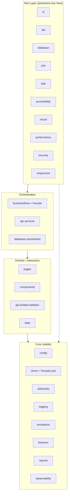
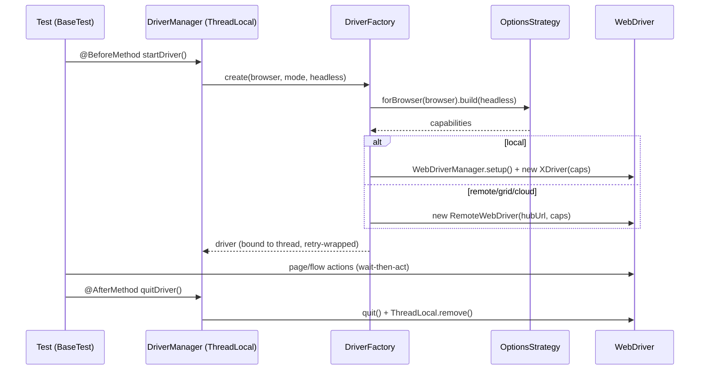
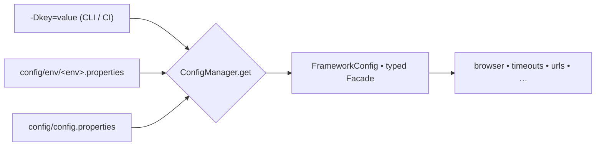
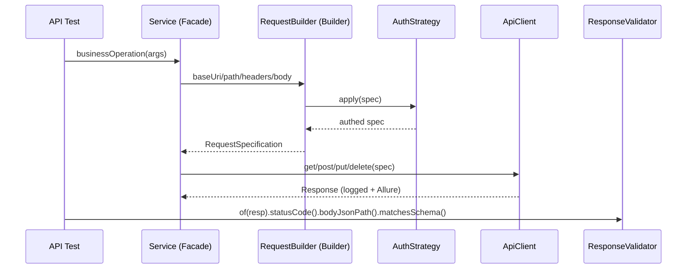
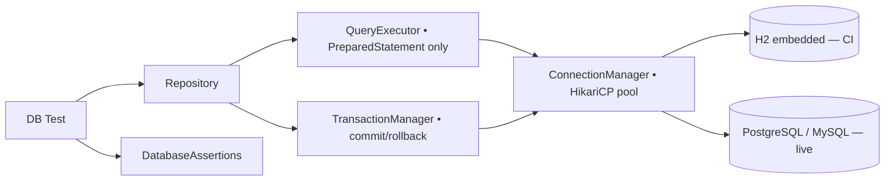
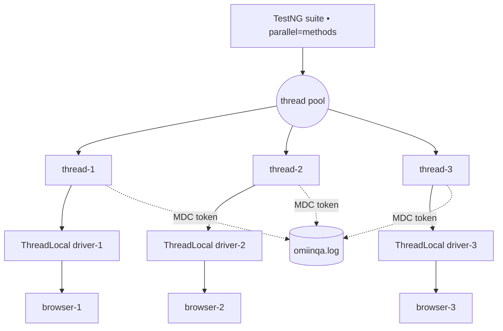
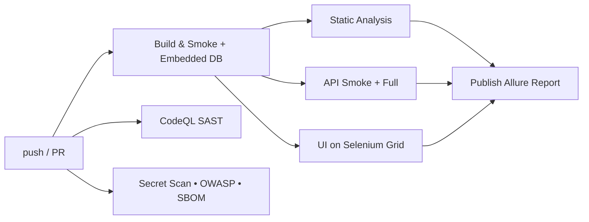
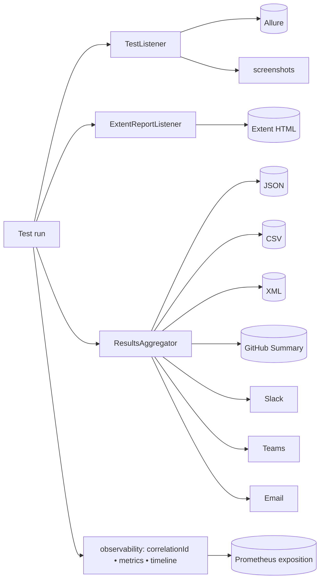
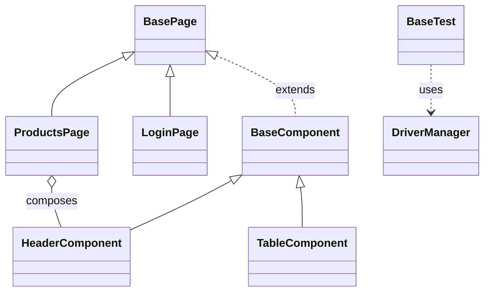

# OmiinQA — Architecture & Flow Diagrams

Rendered Mermaid diagrams of the framework's structure and runtime behavior.
(GitHub renders Mermaid natively.)

## 1. Layered architecture

## 2. Driver lifecycle (per test method)

## 3. Configuration resolution (precedence)

## 4. API request flow

## 5. Database flow

## 6. Parallel execution model

## 7. CI/CD pipeline (GitHub Actions)

## 8. Reporting & observability

## 9. Component composition (page objects)

